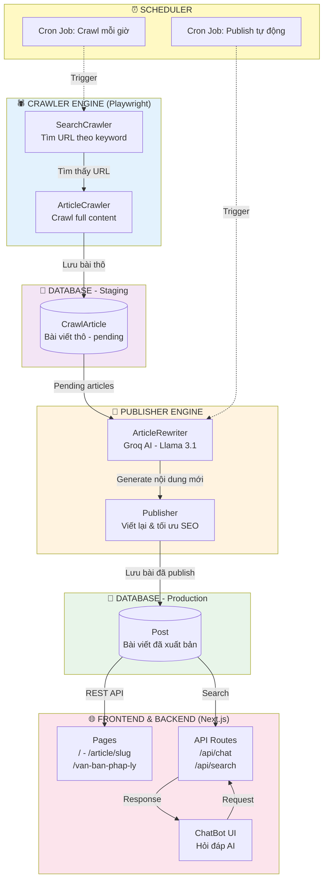

# Crypto News Hub - Cổng Tin Tức Tiền Mã Hóa Tự Động 🤖📰

> Nền tảng tin tức crypto tự động hóa hoàn toàn bằng AI và Crawler - Tự động thu thập, viết lại, tối ưu SEO và đăng bài.

[](https://nextjs.org/)
[](https://reactjs.org/)
[](https://www.typescriptlang.org/)
[](https://www.prisma.io/)
[](https://playwright.dev/)
[-orange.svg)](https://groq.com/)

---

## 📑 Mục lục

1. [Mô tả Dự án](#1-mô-tả-dự-án)
2. [Kiến trúc Hệ thống](#2-kiến-trúc-hệ-thống)
3. [Cài đặt](#3-cài-đặt)
4. [Hướng dẫn Sử dụng](#4-hướng-dẫn-sử-dụng)
5. [Cấu trúc Database](#5-cấu-trúc-database)
6. [Tech Stack](#6-tech-stack)
7. [Troubleshooting](#7-troubleshooting)
8. [Thông tin Dự án](#8-thông-tin-dự-án)

---

## 1. MÔ TẢ DỰ ÁN

### 1.1 Tổng quan

**Crypto News Hub** là một cổng thông tin tiền mã hóa tự động, được xây dựng để giải quyết bài toán sản xuất nội dung quy mô lớn. Hệ thống tự động hóa toàn bộ quy trình: từ việc tìm kiếm và thu thập tin tức từ các nguồn uy tín, sử dụng AI để viết lại và tối ưu hóa SEO, cho đến việc tự động đăng bài theo lịch.

**Thành phần chính:**
- 🎨 **Frontend**: Next.js 14 & React 19 (Server Components)
- ⚙️ **Backend**: Next.js API Routes
- 🤖 **AI Layer**: Groq API (Llama 3.1) cho Chatbot và Viết lại nội dung
- 🕷️ **Crawler Engine**: Playwright & Cheerio
- 💾 **Database**: MongoDB & Prisma ORM

### 1.2 Tính năng nổi bật

#### 1.2.1 Cho Người đọc (Public)
- 📰 Đọc tin tức crypto mới nhất, được phân loại rõ ràng.
- 🤖 **AI Chatbot thông minh**: Hỏi đáp về bất kỳ chủ đề crypto nào, chatbot có khả năng tìm kiếm và trả về các bài viết liên quan trong database.
- 🔍 Tìm kiếm bài viết nhanh chóng.
- ⚖️ Đọc các văn bản pháp lý liên quan đến ngành.

#### 1.2.2 Tự động hóa (Automation)
- 🕷️ **Tự động Crawl**: Quét các trang tin tức lớn (VnExpress, Tuổi Trẻ) để tìm bài viết có từ khóa crypto.
- ✍️ **AI Article Rewriter**: Tự động viết lại hoàn toàn các bài báo đã crawl. AI sẽ tạo ra tiêu đề SEO, mô tả meta, và nội dung mớiユニーク, đảm bảo chất lượng và tránh trùng lặp.
- 📅 **Scheduler (Cron Job)**:
    - Tự động chạy tác vụ crawl hàng giờ.
    - Tự động chạy tác vụ đăng bài (publish) các bài đã được AI xử lý.
- ✨ **Checksum & Deduplication**: Hệ thống tự động phát hiện bài viết trùng lặp hoặc đã được cập nhật nội dung từ nguồn để crawl lại.

### 1.3 Thống kê Dự án

| Metric | Giá trị |
|--------|---------|
| **Frontend** | 10+ Next.js Pages & Components |
| **Backend** | 5+ API Endpoints |
| **AI Modules** | 2 (Article Rewriter, Chatbot) |
| **Crawler** | 2 Nguồn (VnExpress, Tuổi Trẻ) |
| **Database** | 5 Collections (Prisma Models) |
| **Scripts Tự động** | 5+ (crawl, auto-crawl, publish, ...) |

---

## 2. KIẾN TRÚC HỆ THỐNG

### 2.1 Sơ đồ Tổng quan



### 2.2 Luồng hoạt động (Data Flow)

#### 2.2.1 Flow 1: Tự động thu thập và đăng bài
1.  **Scheduler (`cron`)** kích hoạt `auto-crawl-crypto.ts` mỗi giờ.
2.  **`searchAllSources`**: Script tìm kiếm các từ khóa (`bitcoin`, `ethereum`,...) trên các trang nguồn.
3.  **`batchCrawlArticles`**: Các URL tìm được sẽ được đưa vào hàng đợi. Playwright mở nhiều tab đồng thời để crawl nội dung chi tiết (tiêu đề, HTML, ảnh,...).
4.  **`saveCrawledArticle`**:
    - Tính `checksum` (hash) cho nội dung bài viết.
    - Nếu URL chưa có trong DB -> Lưu vào collection `CrawlArticle` với status `pending`.
    - Nếu URL đã có nhưng `checksum` khác -> Cập nhật lại nội dung và đổi status thành `pending`.
    - Nếu `checksum` giống hệt -> Bỏ qua.
5.  **Scheduler (`cron`)** kích hoạt `publish-articles.ts`.
6.  **`publishPendingArticles`**: Script lấy các bài `pending` từ `CrawlArticle`.
7.  **`ArticleRewriter (AI)`**: Với mỗi bài, gọi API Groq (Llama 3.1) để:
    - Tạo `title` mới, chuẩn SEO.
    - Tạo `description` (meta description) mới.
    - Viết lại toàn bộ `content` (HTML).
    - Gợi ý `category`.
8.  **Lưu vào `Post`**: Dữ liệu do AI tạo ra được lưu vào collection `Post`. Bài viết trong `CrawlArticle` được cập nhật status thành `processed`.
9.  **Hiển thị trên Frontend**: Người dùng thấy bài viết mới trên trang chủ.

#### 2.2.2 Flow 2: Tương tác với Chatbot
1.  Người dùng nhập câu hỏi vào `ChatBot.tsx`.
2.  Component gọi đến endpoint `/api/chat`.
3.  **`route.ts`** nhận request và xây dựng một prompt chi tiết cho Groq AI.
4.  **AI Xác định ý định (Intent)**: AI phân tích câu hỏi để xác định người dùng muốn `tìm kiếm thông tin` hay `hỏi đáp chung`.
5.  **Tìm kiếm (Nếu có)**: Nếu là intent tìm kiếm, AI sẽ tạo ra các từ khóa và `route.ts` sẽ dùng Prisma để full-text search trong collection `Post`.
6.  **AI Trả lời**: Kết quả tìm kiếm (nếu có) và câu hỏi gốc được gửi lại cho Groq để tạo ra câu trả lời cuối cùng.
7.  Kết quả (văn bản + danh sách bài viết liên quan) được trả về cho frontend.

---

## 3. CÀI ĐẶT

### 3.1 Yêu cầu Hệ thống

| Component | Version |
|-----------|---------|
| Node.js | 20.0+ |
| npm/pnpm/yarn | latest |
| MongoDB | Latest (hoặc Atlas) |
| Git | Latest |

### 3.2 Hướng dẫn cài đặt

1.  **Clone repository**:
    ```bash
    git clone <your-repo-url>
    cd Crypto_news
    ```

2.  **Cài đặt dependencies**:
    ```bash
    npm install
    ```

3.  **Thiết lập biến môi trường**:
    Tạo file `.env` từ file `.env.example` (nếu có) hoặc tạo mới và điền các thông tin sau:
    ```env
    # Link kết nối tới MongoDB Atlas hoặc local
    DATABASE_URL="mongodb+srv://<user>:<password>@cluster.../your-db-name"

    # API Key từ Groq (https://console.groq.com/keys)
    GROQ_API_KEY="gsk_..."

    # (Optional) Các biến môi trường khác
    ```

4.  **Khởi tạo Database với Prisma**:
    Lệnh này sẽ đọc `schema.prisma` và đảm bảo các collections/indexes được tạo trên MongoDB.
    ```bash
    npx prisma generate
    npx prisma db push
    ```

5.  **Chạy development server**:
    ```bash
    npm run dev
    ```

✅ **Mở trình duyệt**: `http://localhost:3000`

---

## 4. HƯỚNG DẪN SỬ DỤNG

Hệ thống bao gồm các script chính để tự động hóa.

### 4.1 Crawl thủ công một URL
Dùng để debug hoặc crawl một bài viết cụ thể.
```bash
npm run crawl <url_bai_viet>
# Ví dụ:
npm run crawl https://vnexpress.net/bitcoin-vuot-70-000-usd-4752222.html
```

### 4.2 Chạy tác vụ Auto-Crawl
Script này sẽ tìm kiếm và crawl hàng loạt bài viết dựa trên các từ khóa mặc định.
```bash
npm run auto-crawl
```
**Tùy chỉnh:**
```bash
# Tùy chỉnh từ khóa và số lượng
npm run auto-crawl -- --keyword "Solana" --max 10
```

### 4.3 Chạy tác vụ Publish
Script này sẽ lấy các bài viết `pending` đã crawl, dùng AI viết lại và đẩy vào bảng `Post` để hiển thị.
```bash
npm run publish
```

### 4.4 Chạy Scheduler (Production)
Để hệ thống hoàn toàn tự động, bạn cần chạy `scheduler-daemon.ts` ở chế độ nền (ví dụ: dùng `pm2`).
```bash
# Chạy trực tiếp
ts-node scripts/scheduler-daemon.ts

# Chạy với PM2 (khuyến khích cho production)
# pm2 start scripts/scheduler-daemon.ts --interpreter ts-node
```

---

## 5. CẤU TRÚC DATABASE (`schema.prisma`)

- `Category`: Lưu các danh mục tin tức (VD: Tin tức BTC, Phân tích kỹ thuật).
- `Post`: **Bảng chính**, chứa các bài viết đã được AI xử lý và sẵn sàng hiển thị cho người dùng.
- `UnsplashImage`: (Dành cho tương lai) Lưu thông tin ảnh từ Unsplash để tránh fetch lại.
- `LegalDocument`: Chứa các văn bản pháp lý.
- `CrawlArticle`: **Bảng tạm (staging)**, chứa các bài viết thô vừa được crawl về, chờ AI xử lý.

---

## 6. TECH STACK

### 6.1 Frontend & Backend

| Technology | Version | Purpose |
|------------|---------|---------|
| Next.js | 14+ | Fullstack Framework (UI & API) |
| React | 19 | UI Library |
| TypeScript | 5 | Type Safety |
| TailwindCSS | 4 | Styling |
| Lucide React | latest | Icons |
| Framer Motion| 11+ | Animations |

### 6.2 Database & AI

| Technology | Version/Model | Purpose |
|------------|---------------|---------|
| MongoDB | latest | NoSQL Database |
| Prisma | 5.22.0 | ORM, quản lý DB schema |
| Groq | Llama 3.1 | AI Rewriter & Chatbot |
| Playwright | 1.57.0 | Crawler Engine (Headless Browser) |
| Cheerio | 1.1.2 | Phân tích HTML (server-side) |
| node-cron | 3.0.3 | Lập lịch tác vụ tự động |

---

## 7. TROUBLESHOOTING

**❌ Lỗi `npm install`**
- Xóa `node_modules` và `package-lock.json`.
- Chạy lại `npm install`.

**❌ Lỗi kết nối MongoDB**
- Kiểm tra lại chuỗi `DATABASE_URL` trong file `.env`.
- Đảm bảo IP của bạn đã được whitelist trên MongoDB Atlas.

**❌ Lỗi API Groq (429 Too Many Requests)**
- API của Groq có rate limit. Chatbot và các script đã có cơ chế retry với `exponential backoff`. Nếu vẫn lỗi, hãy chờ vài phút.
- Kiểm tra API Key trong `.env`.

**❌ Playwright không chạy được**
- Lần đầu chạy, Playwright cần tải xuống trình duyệt. Nếu quá trình này lỗi, hãy chạy:
  ```bash
  npx playwright install
  ```

---

## 8. THÔNG TIN DỰ ÁN

### 8.1 Cấu trúc thư mục

```
Crypto_news/
│
├─📁 app/                          # Next.js App Router
│  ├─📁 api/                       # API Routes
│  │  ├─📁 chat/                   # Chatbot endpoint
│  │  ├─📁 search/                 # Search endpoint
│  │  └─📁 scheduler/              # Scheduler status
│  ├─📁 [slug]/                    # Dynamic routes - chi tiết bài
│  ├─📁 article/[slug]/            # Trang bài viết
│  ├─📁 van-ban-phap-ly/           # Trang văn bản pháp lý
│  ├─📄 layout.tsx                 # Root layout
│  ├─📄 page.tsx                   # Trang chủ
│  └─📄 globals.css                # Global styles
│
├─📁 components/                   # React Components
│  ├─📄 ChatBot.tsx                # 🤖 AI Chatbot UI
│  ├─📄 SearchBox.tsx              # 🔍 Search component
│  ├─📁 header-web/                # Header components
│  ├─📁 footer-web/                # Footer components
│  └─📁 page/                      # Page-specific components
│
├─📁 lib/                          # Core Business Logic
│  ├─📁 ai/                        # 🤖 AI Modules
│  │  └─📄 articleRewriter.ts     # Groq AI rewriter
│  ├─📁 crawler/                   # 🕷️ Crawler Engine
│  │  ├─📄 searchCrawler.ts       # Tìm URL theo keyword
│  │  ├─📄 articleCrawler.ts      # Crawl full content
│  │  └─📄 crawlRepository.ts     # Lưu vào DB
│  ├─📁 publisher/                 # 📰 Publisher Logic
│  │  └─📄 articlePublisher.ts    # Publish articles
│  ├─📁 scheduler/                 # ⏰ Scheduler
│  │  └─📄 crawlScheduler.ts      # Cron job logic
│  ├─📁 unsplash/                  # 🖼️ Image service
│  └─📄 prisma.ts                  # Prisma client instance
│
├─📁 models/                       # Data Models
│  ├─📄 postModel.ts               # Post queries
│  └─📄 catalogModel.ts            # Catalog queries
│
├─📁 prisma/                       # 💾 Database
│  └─📄 schema.prisma              # MongoDB schema definition
│
├─📁 scripts/                      # 🔧 Automation Scripts
│  ├─📄 auto-crawl-crypto.ts      # Tự động crawl mỗi giờ
│  ├─📄 publish-articles.ts       # Tự động publish bài
│  ├─📄 scheduler-daemon.ts       # Cron daemon process
│  ├─📄 crawl-crypto-news.ts      # Manual crawl script
│  └─📄 verify-images.ts          # Kiểm tra ảnh
│
├─📁 public/                       # Static assets
├─📄 package.json                  # Dependencies
├─📄 tsconfig.json                 # TypeScript config
├─📄 next.config.ts                # Next.js config
└─📄 README.md                     # Documentation
```

### 8.2 License

MIT License

---

**🎉 Built with ❤️ using Next.js, Prisma, Playwright & Groq AI**

**Version 1.0.0**

## Categories

- Tin tức
- Phân tích
- Kiến thức
- Pháp lý
- Hướng dẫn
- Bảng giá

## Environment Variables

```env
DATABASE_URL="mongodb+srv://..."
GROQ_API_KEY="gsk_..."
```

## Deploy on Vercel

The easiest way to deploy your Next.js app is to use the [Vercel Platform](https://vercel.com).